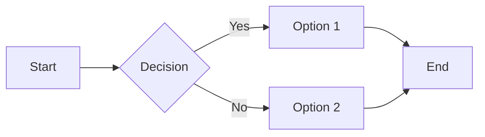
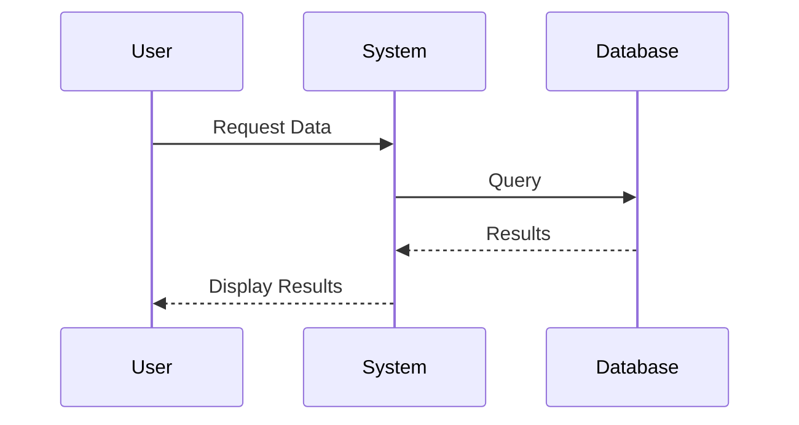
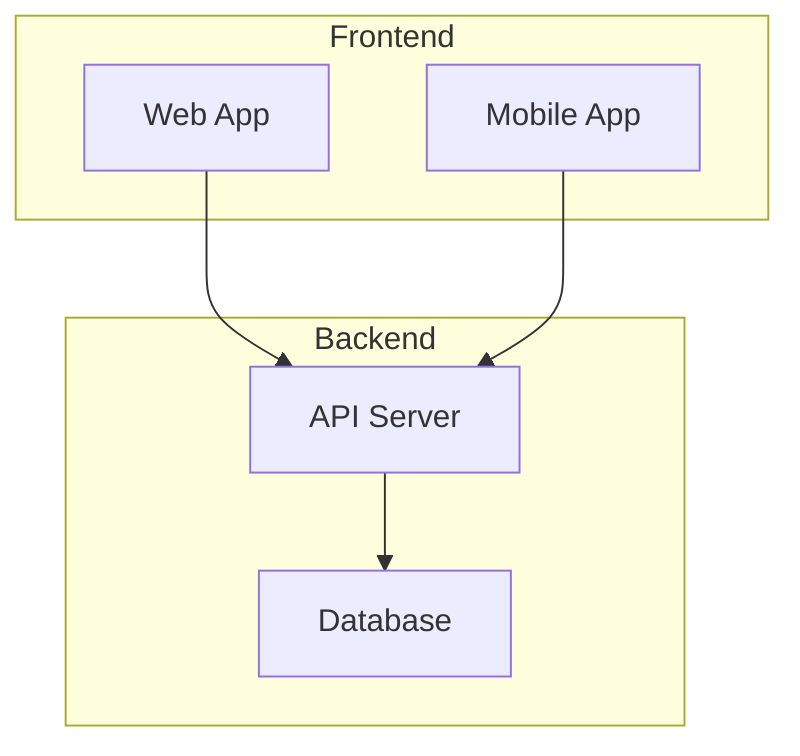

# Mermaid Diagram Test

This file tests if Mermaid diagrams render correctly in VS Code.

## Test 1: Simple Flowchart



## Test 2: Sequence Diagram



## Test 3: Graph with Subgraphs



## Instructions

1. Open this file in VS Code
2. Press `Cmd+Shift+V` (macOS) or `Ctrl+Shift+V` (Windows/Linux) to open preview
3. Or press `Cmd+K V` (macOS) or `Ctrl+K V` (Windows/Linux) for side-by-side preview
4. You should see the three diagrams rendered above

## If diagrams don't show:

1. **Check extensions**:
   - "Markdown Preview Mermaid Support" should be installed and enabled
   
2. **Reload VS Code**:
   - Press `Cmd+Shift+P` / `Ctrl+Shift+P`
   - Type "Reload Window"
   
3. **Alternative preview**:
   - Right-click on this file in Explorer
   - Select "Open Preview"

4. **View in browser**:
   - Push to GitHub/GitLab and view there
   - Use a markdown preview tool online

## Extensions to ensure are installed:

```vscode-extensions
bierner.markdown-mermaid
```

This extension adds Mermaid support to VS Code's built-in markdown preview.
