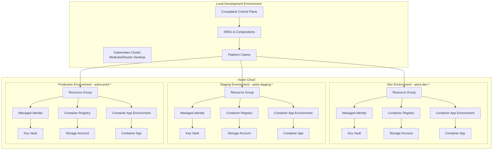
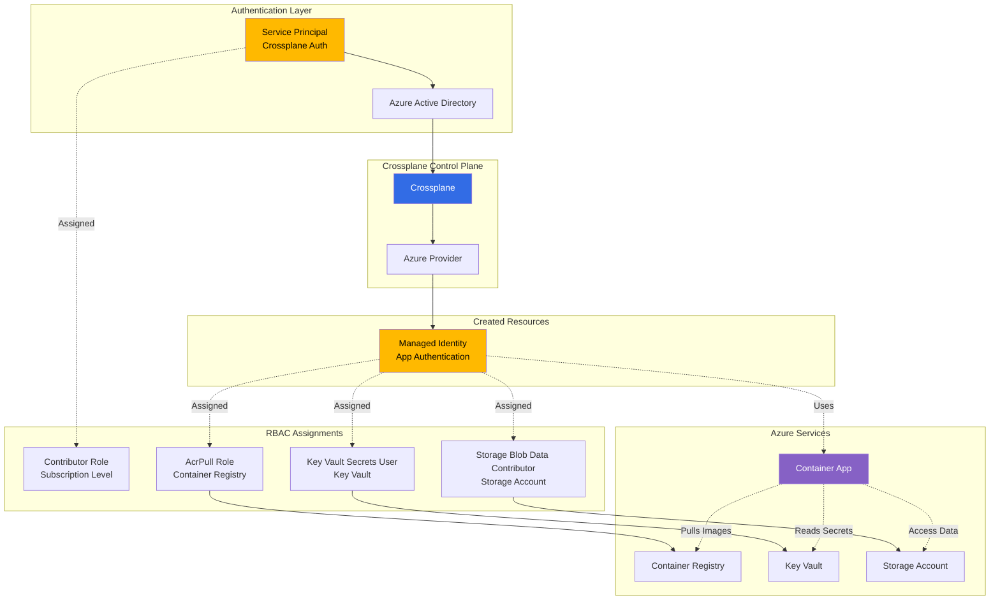
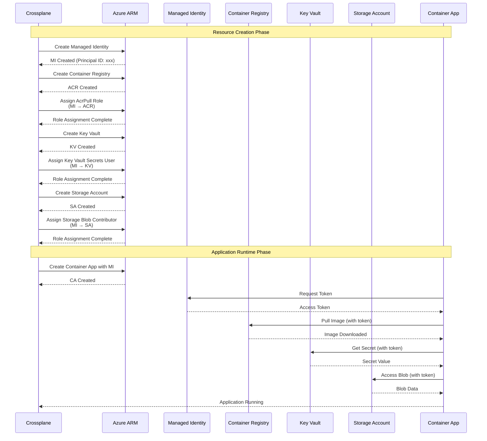
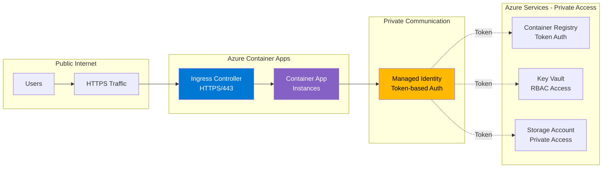
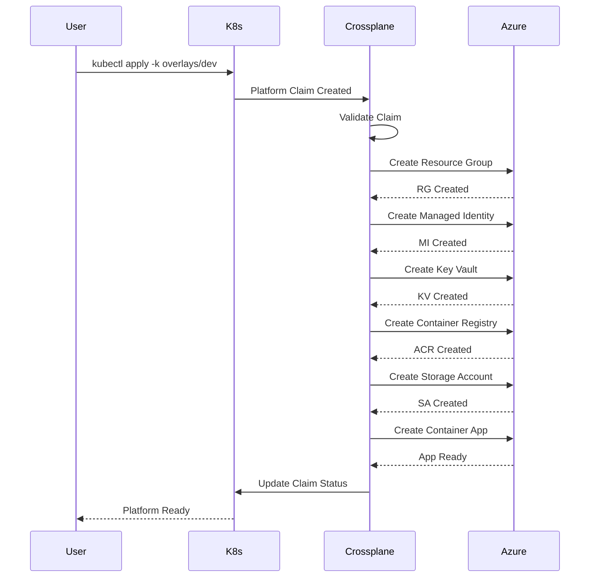
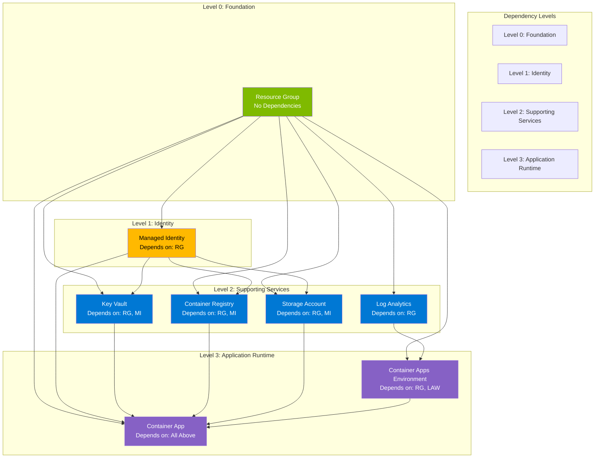
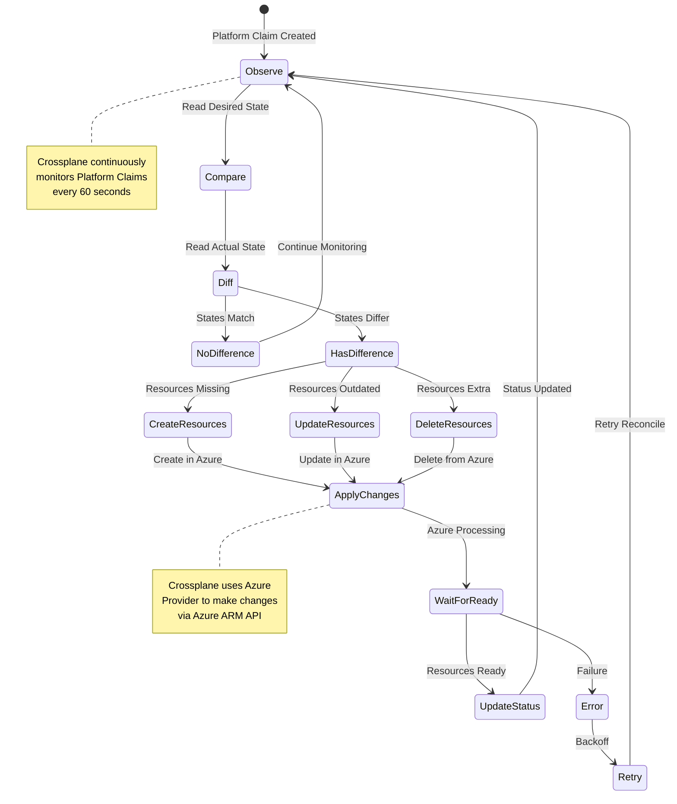
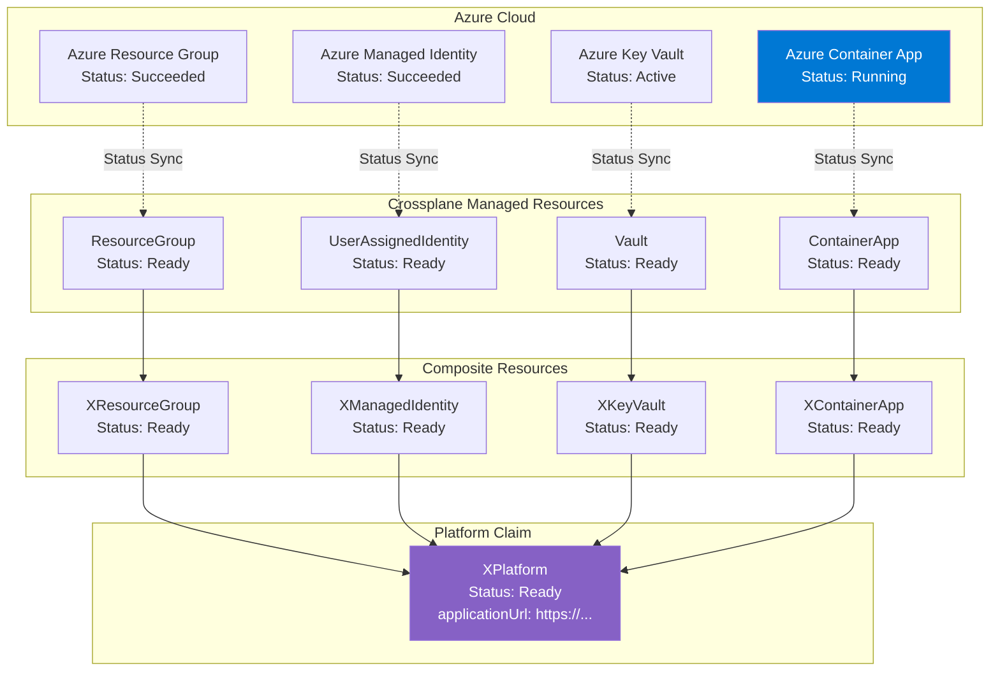

# Platform Architecture

The Astra Platform is built on Crossplane to provide a declarative, Kubernetes-native approach to managing Azure infrastructure and Container Apps deployment.

## 🏗️ High-Level Architecture



## 🔧 Core Components

### 1. Crossplane Control Plane
- **Purpose**: Kubernetes-native infrastructure management
- **Version**: 1.14.0
- **Provider**: Azure Provider v0.36.0
- **Deployment**: Runs locally in Minikube or Docker Desktop

### 2. Custom Resource Definitions (XRDs)
Seven XRDs define the platform's API surface:

| XRD | Purpose | Azure Resources |
|-----|---------|-----------------|
| `XResourceGroup` | Resource container | Resource Group |
| `XManagedIdentity` | Authentication | User Assigned Managed Identity |
| `XKeyVault` | Secrets management | Key Vault + Access Policies |
| `XContainerRegistry` | Image storage | Azure Container Registry |
| `XStorage` | Data persistence | Storage Account + Blob Container |
| `XContainerApp` | Application runtime | Container App + Environment |
| `XPlatform` | Orchestrator | All above resources |

### 3. Compositions
Compositions implement the XRDs using Azure Provider resources:

```yaml
XPlatform (Orchestrator)
├── XResourceGroup → azurerm_resource_group
├── XManagedIdentity → azurerm_user_assigned_identity
├── XKeyVault → azurerm_key_vault + access_policy
├── XContainerRegistry → azurerm_container_registry
├── XStorage → azurerm_storage_account + container
└── XContainerApp → azurerm_container_app + environment
```

## 📋 Resource Hierarchy

### Platform-Level Orchestration
```yaml
XPlatform Claim
├── Dependencies Flow:
│   1. Resource Group (foundation)
│   2. Managed Identity (authentication)
│   3. Key Vault (secrets, depends on MI)
│   4. Container Registry (images, depends on MI)
│   5. Storage Account (data, depends on MI)
│   6. Container App (runtime, depends on all above)
```

### Field Propagation
```yaml
Platform Claim Input:
├── namingPrefix: "astra-dev"
├── location: "Central India"
├── tenantId: "xxx-xxx-xxx"
├── containerImage: "app:latest"
└── scaling parameters

Automatic Field Mapping:
├── Resource Group: "${namingPrefix}-rg"
├── Managed Identity: "${namingPrefix}-mi"
├── Key Vault: "${namingPrefix}-kv"
├── Container Registry: "${namingPrefix}acr" (no hyphens)
├── Storage Account: "${namingPrefix}sa" (no hyphens)
└── Container App: "${namingPrefix}-app"
```

## 🔐 Security Architecture

### 1. Azure RBAC Integration


### 2. Identity and Access Flow


### 2. Network Security
- **Container Apps**: Public ingress with HTTPS termination
- **Key Vault**: Network access policies (configurable)
- **Storage**: Private blob access via Managed Identity
- **Container Registry**: Token-based authentication



### 3. Secrets Management
```yaml
Secret Flow:
1. Azure Service Principal → Kubernetes Secret
2. ProviderConfig → References K8s Secret
3. Managed Identity → Created by Crossplane
4. Container App → Uses Managed Identity
5. Key Vault → Accessible via Managed Identity
```

## 🌍 Multi-Environment Strategy

### Environment Isolation
Each environment gets its own:
- Azure Resource Group
- Managed Identity with scoped permissions
- Complete resource stack
- Kubernetes namespace

### Environment Configurations
| Environment | Namespace | Replicas | Resources | Purpose |
|-------------|-----------|----------|-----------|---------|
| **dev** | `astra-dev` | 1-3 | 0.25 CPU, 0.5Gi | Development/Testing |
| **staging** | `astra-staging` | 2-5 | 0.5 CPU, 1Gi | Pre-production validation |
| **prod** | `astra-prod` | 3-10 | 1.0 CPU, 2Gi | Production workloads |

### Kustomize Overlays
```yaml
Base Configuration (packages/platform/):
├── XRD definitions
├── Compositions
└── Default platform claim

Environment Overlays (overlays/{env}/):
├── Environment-specific values
├── Resource scaling
├── Configuration overrides
└── Namespace targeting
```

## 🔄 Deployment Flow

### 1. Platform Claim Lifecycle


### 2. Resource Dependencies
```yaml
Dependency Chain:
1. Resource Group (no dependencies)
2. Managed Identity → Resource Group
3. Key Vault → Resource Group + Managed Identity
4. Container Registry → Resource Group + Managed Identity
5. Storage Account → Resource Group + Managed Identity
6. Container App → Resource Group + All above resources
```



## � Crossplane Reconciliation Loop



## �📊 Monitoring & Observability

### 1. Crossplane Observability
```yaml
Monitoring Points:
├── XRD Status: kubectl get xrd
├── Composition Health: kubectl get compositions
├── Claim Status: kubectl get xplatform -n {namespace}
├── Managed Resources: kubectl get managedresources
└── Provider Logs: kubectl logs -n crossplane-system
```

### 2. Resource Status Propagation



### 2. Azure Resource Monitoring
```yaml
Azure Monitoring:
├── Resource Groups: az group list
├── Container Apps: az containerapp list
├── Application Insights: Built-in monitoring
├── Log Analytics: Centralized logging
└── Azure Monitor: Metrics and alerts
```

### 3. Status Propagation
```yaml
Status Flow:
Azure Resource Status → Managed Resource → Composition → XRD → Platform Claim

Platform Claim Status Fields:
├── .status.ready: Overall readiness
├── .status.applicationUrl: Container App FQDN
├── .status.resourceGroupName: Created RG name
├── .status.managedIdentityId: Identity resource ID
└── .status.{service}Name: Individual resource names
```

## 🔧 Extensibility

### 1. Adding New Azure Services
```yaml
Extension Pattern:
1. Create new XRD definition
2. Create corresponding Composition
3. Add to Platform Composition as dependency
4. Update environment overlays
5. Test in dev environment
```

### 2. Custom Configurations
```yaml
Customization Points:
├── Resource naming patterns
├── Azure regions and availability zones
├── Container App scaling policies
├── Network security configurations
├── Backup and retention policies
└── Monitoring and alerting rules
```

## 🚀 Performance Characteristics

### 1. Deployment Times
- **Initial Platform**: 8-12 minutes
- **Application Update**: 2-3 minutes
- **Scaling Events**: 30-60 seconds
- **Environment Teardown**: 5-8 minutes

### 2. Resource Limits
- **Max Environments**: Limited by Azure subscription quotas
- **Container Apps**: 10 replicas max per environment (configurable)
- **Concurrent Deployments**: 3 environments simultaneously
- **Resource Groups**: 980 per subscription (Azure limit)

### 3. Cost Optimization
- **Development**: ~$10-20/month per environment
- **Production**: ~$50-100/month per environment
- **Auto-scaling**: Scales to zero when no traffic
- **Shared Resources**: Container Registry shared across environments

## 🔮 Future Enhancements

### Planned Features
- [ ] Multi-region deployment support
- [ ] Database integration (PostgreSQL, Redis)
- [ ] Service mesh integration (Istio)
- [ ] GitOps workflow (ArgoCD)
- [ ] Advanced networking (VNet integration)
- [ ] Disaster recovery automation

### Architecture Evolution
- Support for Azure Kubernetes Service (AKS)
- Integration with Azure Arc
- Multi-cloud support (AWS, GCP)
- Advanced RBAC with Azure AD groups