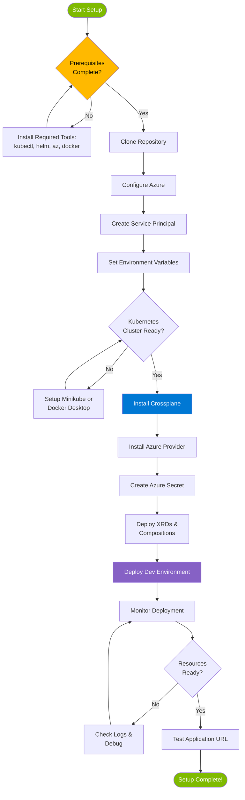
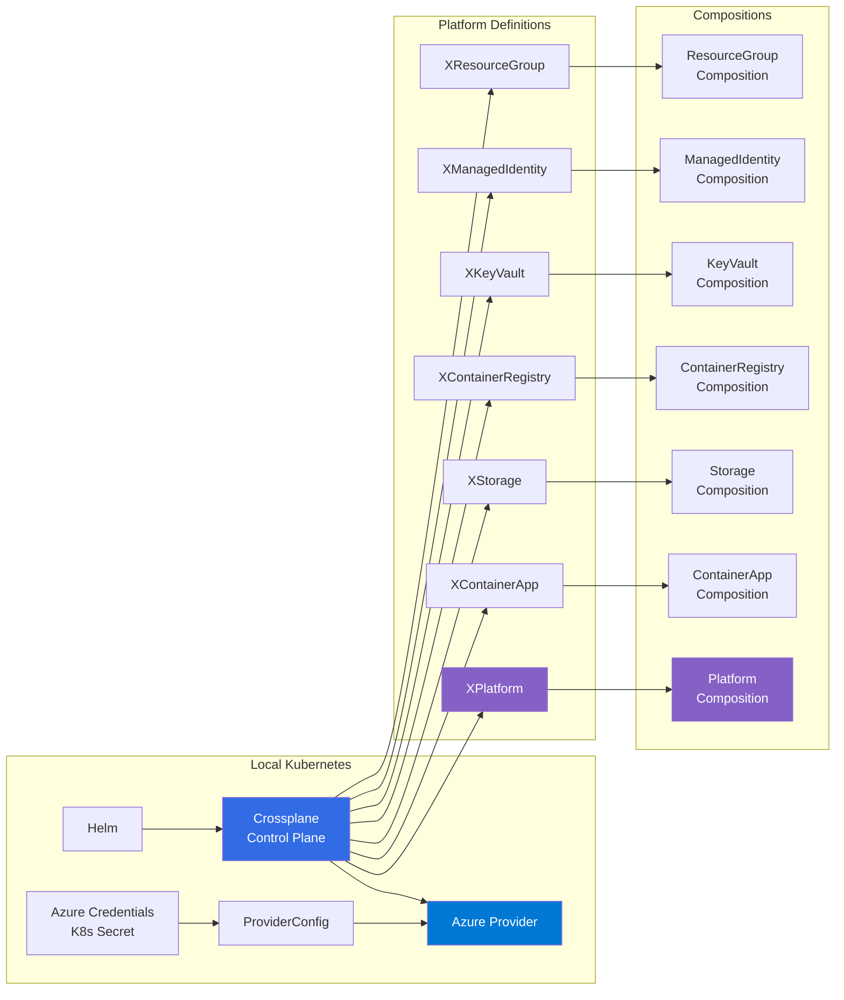

# Initial Setup Guide

This comprehensive guide will walk you through setting up the Astra Platform from scratch. Follow these steps carefully to ensure a successful deployment.

## 📋 Overview

The Astra Platform setup involves:
1. Setting up Crossplane in your Kubernetes cluster
2. Configuring Azure credentials and providers
3. Installing Astra Platform components
4. Deploying to your first environment

Estimated time: **30-45 minutes**

## 🗺️ Setup Journey Map



## 🏗️ Platform Components Installation



## 🚀 Step 1: Verify Prerequisites

Before starting, ensure you have completed the [Prerequisites](prerequisites.md) guide.

Quick verification:
```bash
# Verify all required tools
docker --version
kubectl cluster-info
helm version
az --version
git --version
jq --version
```

## 🔧 Step 2: Clone the Repository

```bash
# Clone the Astra Platform repository
git clone <repository-url>
cd astra-platform

# Verify project structure
ls -la
# Should see: packages/, overlays/, scripts/, .github/, docs/
```

## ☁️ Step 3: Setup Azure Credentials

### 3.1 Login to Azure
```bash
# Login to Azure CLI
az login

# Set your subscription (if you have multiple)
az account set --subscription "your-subscription-id"

# Verify current subscription
az account show
```

### 3.2 Create Service Principal
```bash
# Get your subscription ID
SUBSCRIPTION_ID=$(az account show --query id -o tsv)

# Create service principal with contributor role
az ad sp create-for-rbac \
  --name "astra-platform-sp-$(date +%s)" \
  --role "Contributor" \
  --scopes "/subscriptions/$SUBSCRIPTION_ID" \
  --output json
```

**Save the output!** You'll need these credentials:
```json
{
  "appId": "your-client-id",
  "displayName": "astra-platform-sp-xxx",
  "password": "your-client-secret",
  "tenant": "your-tenant-id"
}
```

### 3.3 Set Environment Variables
```bash
# Set Azure credentials as environment variables
export AZURE_CLIENT_ID="your-client-id"
export AZURE_CLIENT_SECRET="your-client-secret"
export AZURE_TENANT_ID="your-tenant-id"
export AZURE_SUBSCRIPTION_ID="your-subscription-id"

# Verify credentials
echo "Client ID: $AZURE_CLIENT_ID"
echo "Tenant ID: $AZURE_TENANT_ID"
echo "Subscription ID: $AZURE_SUBSCRIPTION_ID"
```

### 3.4 Test Azure Authentication
```bash
# Test service principal authentication
az login --service-principal \
  --username $AZURE_CLIENT_ID \
  --password $AZURE_CLIENT_SECRET \
  --tenant $AZURE_TENANT_ID

# List available resource groups (should work without errors)
az group list --output table
```

## 🐳 Step 4: Setup Kubernetes Cluster

### Option A: Minikube (Recommended)
```bash
# Start Minikube cluster with recommended resources
minikube start --driver=docker --cpus=4 --memory=8192 --disk-size=20g

# Verify cluster is running
kubectl cluster-info
kubectl get nodes

# Check Minikube status
minikube status

# Enable required addons (optional but recommended)
minikube addons enable metrics-server
minikube addons enable dashboard
```

**Minikube Configuration Options:**
```bash
# Start with custom configuration
minikube start \
  --driver=docker \
  --kubernetes-version=v1.28.0 \
  --cpus=4 \
  --memory=8192 \
  --disk-size=20g \
  --container-runtime=containerd

# For macOS with Hyperkit
minikube start --driver=hyperkit --cpus=4 --memory=8192

# For Windows with Hyper-V
minikube start --driver=hyperv --cpus=4 --memory=8192
```

### Option B: Docker Desktop
```bash
# Enable Kubernetes in Docker Desktop
# Go to Docker Desktop → Settings → Kubernetes → Enable Kubernetes

# Verify cluster is running
kubectl cluster-info
kubectl get nodes
```

## ⚙️ Step 5: Install Crossplane and Azure Provider

### 5.1 Run Installation Script
```bash
# Make scripts executable (if needed)
chmod +x scripts/*.sh

# Run the installation script
./scripts/install.sh
```

The script will:
- ✅ Install Crossplane using Helm
- ✅ Install Azure Provider
- ✅ Create ProviderConfig with your credentials
- ✅ Install all Astra Platform XRDs and Compositions
- ✅ Create environment namespaces

### 5.2 Verify Installation
```bash
# Check Crossplane pods
kubectl get pods -n crossplane-system

# Check Azure provider
kubectl get providers

# Check XRDs are established
kubectl get xrd
kubectl api-resources | grep astra

# Check compositions
kubectl get compositions
```

Expected output:
```bash
# XRDs should show ESTABLISHED=True
NAME                               ESTABLISHED   OFFERED   AGE
xcontainerapps.astra.platform     True          True      2m
xkeyvaults.astra.platform         True          True      2m
xmanagedidentities.astra.platform True          True      2m
xplatforms.astra.platform         True          True      2m
xresourcegroups.astra.platform    True          True      2m
xstorages.astra.platform          True          True      2m
xcontainerregistries.astra.platform True        True      2m
```

## 🌍 Step 6: Configure Environment-Specific Settings

### 6.1 Update Tenant ID in Platform Claims
```bash
# Update all environment overlays with your tenant ID
sed -i "s/YOUR_TENANT_ID/$AZURE_TENANT_ID/g" overlays/*/platform-claim.yaml

# Verify the update
grep -r "tenantId" overlays/
```

### 6.2 Customize Environment Settings (Optional)
Edit the environment overlay files if needed:

**Development Environment** (`overlays/dev/platform-claim.yaml`):
```yaml
spec:
  parameters:
    namingPrefix: "astra-dev"
    location: "Central India"
    containerImage: "mcr.microsoft.com/azuredocs/containerapps-helloworld:latest"
    minReplicas: 1
    maxReplicas: 3
    cpu: 0.25
    memory: "0.5Gi"
```

**Production Environment** (`overlays/prod/platform-claim.yaml`):
```yaml
spec:
  parameters:
    namingPrefix: "astra-prod"
    location: "Central India"
    containerImage: "mcr.microsoft.com/azuredocs/containerapps-helloworld:latest"
    minReplicas: 3
    maxReplicas: 10
    cpu: 1.0
    memory: "2Gi"
```

## 🚀 Step 7: Deploy Your First Environment

### 7.1 Deploy to Development Environment
```bash
# Deploy to dev environment
./scripts/deploy.sh dev --wait --timeout 900

# This will:
# 1. Apply the dev overlay using Kustomize
# 2. Create all Azure resources
# 3. Wait for the platform to be ready
```

### 7.2 Monitor Deployment Progress
```bash
# Watch platform status
kubectl get xplatform -n astra-dev -w

# Check individual resources
kubectl describe xplatform -n astra-dev

# Check managed resources
kubectl get managedresources.pkg.crossplane.io | grep astra-dev
```

### 7.3 Get Application URL
```bash
# Get the deployed application URL
./scripts/deploy.sh dev --urls

# Or check directly
kubectl get xplatform astra-dev-platform -n astra-dev -o jsonpath='{.status.applicationUrl}'
```

## ✅ Step 8: Verify Deployment

### 8.1 Check Azure Resources
```bash
# List created resource groups
az group list --query "[?starts_with(name, 'astra-dev')]" --output table

# Check container app
az containerapp list --resource-group astra-dev-rg --output table

# Check container registry
az acr list --resource-group astra-dev-rg --output table
```

### 8.2 Test Application Access
```bash
# Get the application URL
APP_URL=$(kubectl get xplatform astra-dev-platform -n astra-dev -o jsonpath='{.status.applicationUrl}')

# Test the application
curl -I "https://$APP_URL"

# Or open in browser
open "https://$APP_URL"  # macOS
start "https://$APP_URL" # Windows
```

## 🎯 Step 9: Optional - Deploy to Additional Environments

### Deploy to Staging
```bash
./scripts/deploy.sh staging --wait
```

### Deploy to Production
```bash
./scripts/deploy.sh prod --wait
```

## 🔒 Step 10: Secure Your Setup

### 10.1 Store Credentials Securely
```bash
# Option 1: Use Azure Key Vault
az keyvault create --name "astra-platform-kv" --resource-group "your-rg" --location "Central India"
az keyvault secret set --vault-name "astra-platform-kv" --name "azure-client-secret" --value "$AZURE_CLIENT_SECRET"

# Option 2: Use environment variables in your shell profile
echo 'export AZURE_CLIENT_ID="your-client-id"' >> ~/.bashrc
echo 'export AZURE_CLIENT_SECRET="your-client-secret"' >> ~/.bashrc
echo 'export AZURE_TENANT_ID="your-tenant-id"' >> ~/.bashrc
echo 'export AZURE_SUBSCRIPTION_ID="your-subscription-id"' >> ~/.bashrc
```

### 10.2 Remove Plain Text Credentials
```bash
# Remove credentials from command history
history -c

# Unset environment variables if needed
unset AZURE_CLIENT_SECRET
```

## 🔧 Step 11: Setup CI/CD (Optional)

### 11.1 Configure GitHub Secrets
If using GitHub Actions, add these secrets to your repository:

1. Go to Repository → Settings → Secrets and variables → Actions
2. Add the following secrets:
   - `AZURE_CLIENT_ID`
   - `AZURE_CLIENT_SECRET`
   - `AZURE_TENANT_ID`
   - `AZURE_SUBSCRIPTION_ID`

### 11.2 Test GitHub Actions
```bash
# Push to trigger validation workflow
git add .
git commit -m "Initial setup complete"
git push origin main
```

## 🎉 Congratulations!

You have successfully set up the Astra Platform! Here's what you now have:

- ✅ Crossplane running in your Kubernetes cluster
- ✅ Azure Provider configured with your credentials
- ✅ Astra Platform components installed
- ✅ Development environment deployed and running
- ✅ Container Apps accessible via public URL
- ✅ Managed Identity with proper RBAC permissions
- ✅ Key Vault for secrets management
- ✅ Container Registry for Docker images
- ✅ Storage Account for application data

## 📚 Next Steps

1. **Explore the Platform**: [User Guides](../user-guides/README.md)
2. **Deploy Your Application**: [Application Deployment](../user-guides/application-deployment.md)
3. **Monitor Your Environment**: [Monitoring & Observability](../user-guides/monitoring-observability.md)
4. **Set Up CI/CD**: [CI/CD Setup](../operations/cicd-setup.md)

## 🆘 Troubleshooting

If you encounter issues:
1. Check [Common Issues](../troubleshooting/common-issues.md)
2. Review [Debugging Guide](../troubleshooting/debugging.md)
3. Examine [Azure Troubleshooting](../troubleshooting/azure-troubleshooting.md)

## 🧹 Cleanup (If Needed)

To remove everything and start over:
```bash
# Remove all Azure resources and Crossplane components
./scripts/cleanup.sh --force

# Or keep Crossplane and only remove Azure resources
./scripts/cleanup.sh --force --azure-only
```