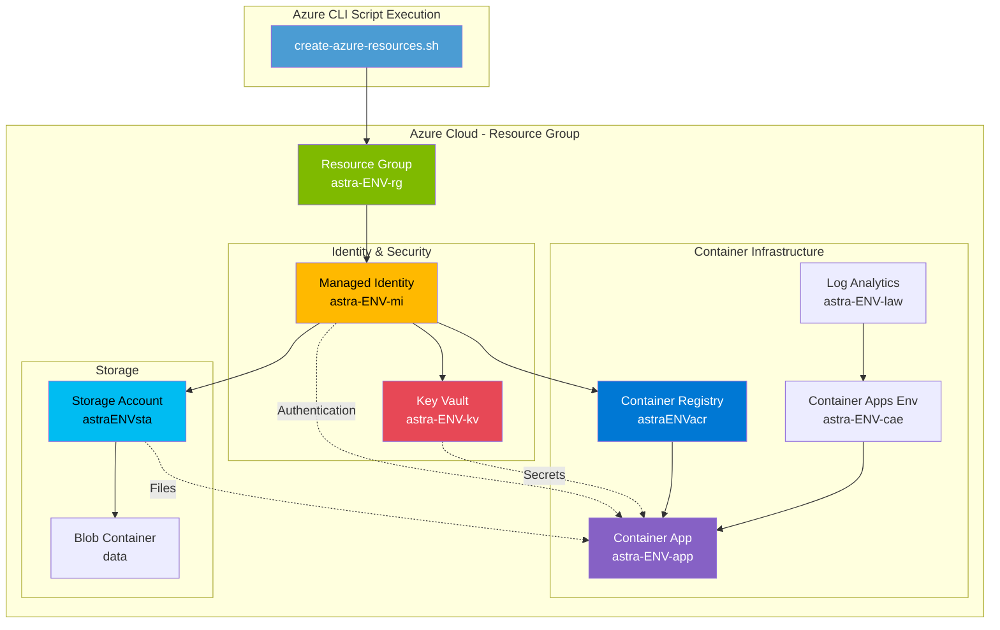
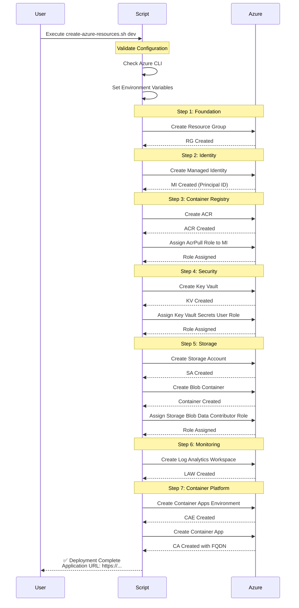
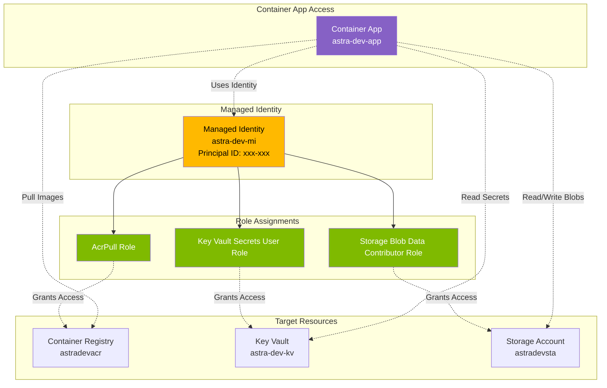
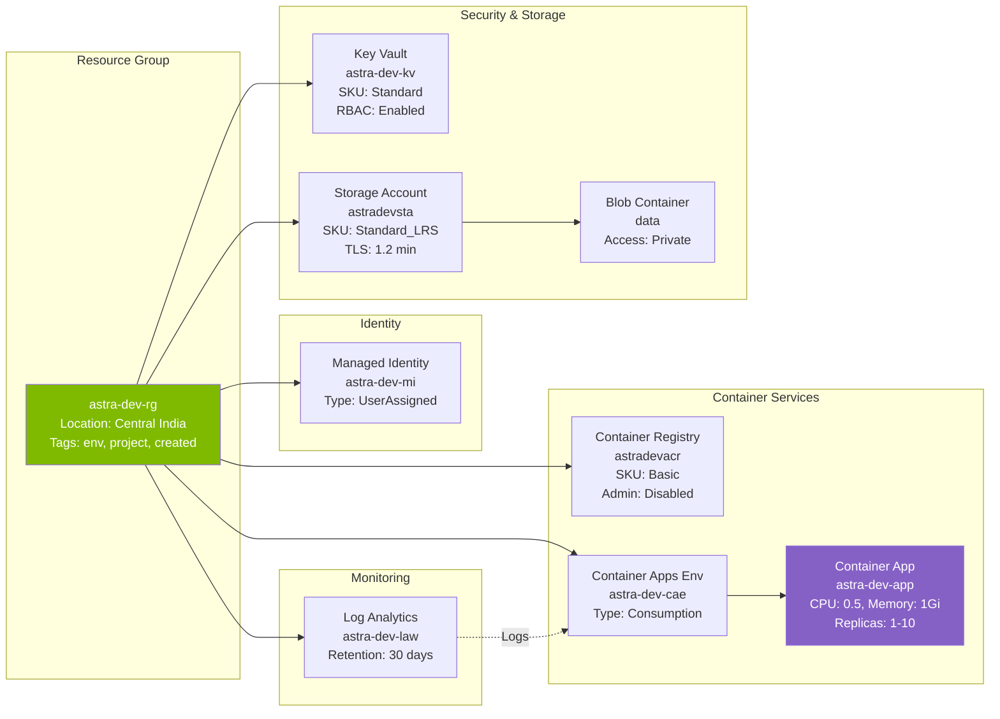

# Azure Resources Creation Script

## Overview

The `create-azure-resources.sh` script creates the complete Azure infrastructure topology for the platform using native Azure CLI commands. It creates all resources following a consistent naming convention and automatically configures role-based access control (RBAC) between resources.

## 🏗️ Infrastructure Topology



## 📋 Resource Creation Flow



## Quick Start

### Basic Usage

```bash
# Create development environment
./scripts/create-azure-resources.sh dev

# Create staging environment
./scripts/create-azure-resources.sh staging

# Create production environment
./scripts/create-azure-resources.sh prod
```

### Custom Resource Prefix

By default, resources are created with the "astra" prefix (e.g., `astra-dev-rg`). You can customize this:

```bash
# Use "myapp" as prefix instead of "astra"
RESOURCE_PREFIX=myapp ./scripts/create-azure-resources.sh dev

# This creates: myapp-dev-rg, myappdevacr, myapp-dev-kv, etc.
```

```bash
# Use "demo" as prefix
RESOURCE_PREFIX=demo ./scripts/create-azure-resources.sh staging

# This creates: demo-staging-rg, demostagingacr, demo-staging-kv, etc.
```

## Configuration Variables

All variables can be overridden by setting environment variables before running the script.

### Core Configuration

| Variable | Default | Description |
|----------|---------|-------------|
| `RESOURCE_PREFIX` | `astra` | Prefix for all resource names |
| `AZURE_LOCATION` | `centralindia` | Azure region for resources |
| `AZURE_SUBSCRIPTION_ID` | Auto-detected | Azure subscription ID |
| `AZURE_TENANT_ID` | Auto-detected | Azure tenant ID |

### Resource SKUs and Tiers

| Variable | Default | Description | Valid Values |
|----------|---------|-------------|--------------|
| `CONTAINER_REGISTRY_SKU` | `Basic` | ACR service tier | Basic, Standard, Premium |
| `KEY_VAULT_SKU` | `standard` | Key Vault service tier | standard, premium |
| `STORAGE_ACCOUNT_SKU` | `Standard_LRS` | Storage redundancy | Standard_LRS, Standard_GRS, Premium_LRS |
| `STORAGE_ACCOUNT_KIND` | `StorageV2` | Storage account type | StorageV2, BlobStorage |

### Container App Configuration

| Variable | Default | Description |
|----------|---------|-------------|
| `CONTAINER_IMAGE` | `mcr.microsoft.com/azuredocs/containerapps-helloworld:latest` | Container image |
| `CONTAINER_APP_CPU` | `0.5` | CPU allocation (cores) |
| `CONTAINER_APP_MEMORY` | `1.0Gi` | Memory allocation |
| `CONTAINER_APP_MIN_REPLICAS` | `1` | Minimum replica count |
| `CONTAINER_APP_MAX_REPLICAS` | `10` | Maximum replica count |
| `CONTAINER_APP_PORT` | `80` | Container port |

## Resource Naming Convention

The script follows this naming pattern:

| Resource Type | Pattern | Example (prefix=astra, env=dev) |
|---------------|---------|--------------------------------|
| Resource Group | `{prefix}-{env}-rg` | astra-dev-rg |
| Container Registry | `{prefix}{env}acr` | astradevacr |
| Key Vault | `{prefix}-{env}-kv` | astra-dev-kv |
| Storage Account | `{prefix}{env}sta` | astradevsta |
| Managed Identity | `{prefix}-{env}-mi` | astra-dev-mi |
| Container Apps Env | `{prefix}-{env}-cae` | astra-dev-cae |
| Container App | `{prefix}-{env}-app` | astra-dev-app |
| Log Analytics | `{prefix}-{env}-law` | astra-dev-law |

**Note**: Container Registry and Storage Account names cannot contain hyphens due to Azure naming restrictions.

## Usage Examples

### Example 1: Development Environment with Defaults

```bash
./scripts/create-azure-resources.sh dev
```

Creates:
- Resource Group: `astra-dev-rg`
- Container Registry: `astradevacr`
- Key Vault: `astra-dev-kv`
- Storage Account: `astradevsta`
- Container App: `astra-dev-app`

### Example 2: Custom Prefix for Team Project

```bash
RESOURCE_PREFIX=teamapp ./scripts/create-azure-resources.sh dev
```

Creates:
- Resource Group: `teamapp-dev-rg`
- Container Registry: `teamappdevacr`
- Key Vault: `teamapp-dev-kv`
- Storage Account: `teamappdevsta`
- Container App: `teamapp-dev-app`

### Example 3: Production with Premium SKUs

```bash
RESOURCE_PREFIX=myapp \
CONTAINER_REGISTRY_SKU=Premium \
STORAGE_ACCOUNT_SKU=Premium_LRS \
CONTAINER_APP_MAX_REPLICAS=50 \
./scripts/create-azure-resources.sh prod
```

Creates production resources with:
- Premium Container Registry
- Premium Storage with local redundancy
- Auto-scaling up to 50 replicas

### Example 4: Different Region

```bash
RESOURCE_PREFIX=euapp \
AZURE_LOCATION=westeurope \
./scripts/create-azure-resources.sh prod
```

Creates resources in West Europe region.

### Example 5: Custom Container Image

```bash
RESOURCE_PREFIX=myapp \
CONTAINER_IMAGE=myregistry.azurecr.io/myapp:latest \
CONTAINER_APP_CPU=1.0 \
CONTAINER_APP_MEMORY=2.0Gi \
./scripts/create-azure-resources.sh dev
```

Deploys your custom container image with increased resources.

## 🔐 RBAC Role Assignments



## 📦 Resource Configuration Details



## Resources Created

The script creates the following Azure resources in order:

### 1. Resource Group
- Base container for all resources
- Tagged with environment, project, and creation date

### 2. Managed Identity
- User-assigned managed identity
- Used for passwordless authentication across services
- Principal ID captured for role assignments

### 3. Container Registry (ACR)
- Container image registry
- Managed identity assigned `AcrPull` role
- Admin user disabled (security best practice)

### 4. Key Vault
- Secrets management service
- RBAC authorization enabled
- Managed identity assigned `Key Vault Secrets User` role
- Enabled for deployment and template deployment

### 5. Storage Account
- Blob storage for application data
- Private blob access (no public access)
- TLS 1.2 minimum
- Managed identity assigned `Storage Blob Data Contributor` role
- Includes `data` blob container

### 6. Log Analytics Workspace
- Monitoring and logging for Container Apps
- Workspace ID and key captured for Container Apps Environment

### 7. Container Apps Environment
- Serverless container hosting environment
- Linked to Log Analytics for monitoring
- Consumption-based pricing

### 8. Container App
- Deployed application
- Configured with:
  - Managed identity for authentication
  - Environment variables (KEY_VAULT_URI, STORAGE_ACCOUNT_NAME, etc.)
  - External ingress with HTTPS
  - Auto-scaling configuration
  - Connection to Container Registry

## Output

The script provides:

1. **Step-by-step progress** with colored output
2. **Resource IDs and URLs** for created resources
3. **Application URL** for accessing the deployed app
4. **Summary** of all created resources
5. **Next steps** for deployment and verification

### Sample Output

```
[INFO] Azure Resources Creation Configuration
========================================
Resource Prefix:          myapp
Environment:              dev
Azure Subscription:       xxxxxxxx-xxxx-xxxx-xxxx-xxxxxxxxxxxx
Azure Location:           centralindia

Resource Group:           myapp-dev-rg
Container Registry:       myappdevacr
Key Vault:                myapp-dev-kv
Storage Account:          myappdevsta
Managed Identity:         myapp-dev-mi
Container Apps Env:       myapp-dev-cae
Container App:            myapp-dev-app
Log Analytics Workspace:  myapp-dev-law
========================================

[SUCCESS] Resource Group created: myapp-dev-rg
[SUCCESS] Managed Identity created: myapp-dev-mi
[SUCCESS] Container Registry created: myappdevacr
[SUCCESS] Key Vault created: myapp-dev-kv
[SUCCESS] Storage Account created: myappdevsta
[SUCCESS] Log Analytics Workspace created: myapp-dev-law
[SUCCESS] Container Apps Environment created: myapp-dev-cae
[SUCCESS] Container App created: myapp-dev-app

Application URL: https://myapp-dev-app.xxx.centralindia.azurecontainerapps.io
```

## Prerequisites

1. **Azure CLI** installed and configured
   ```bash
   az --version
   ```

2. **Azure Login** completed
   ```bash
   az login
   ```

3. **Subscription Access** with Contributor role or higher

4. **Sufficient Quotas** for:
   - Container Apps
   - Container Registry
   - Storage Accounts
   - Key Vault

## Post-Creation Steps

After running the script, you can:

1. **Push your container image to ACR**
   ```bash
   az acr login --name {prefix}{env}acr
   docker tag myapp:latest {prefix}{env}acr.azurecr.io/myapp:latest
   docker push {prefix}{env}acr.azurecr.io/myapp:latest
   ```

2. **Store secrets in Key Vault**
   ```bash
   az keyvault secret set \
     --vault-name {prefix}-{env}-kv \
     --name "DatabasePassword" \
     --value "your-secret-value"
   ```

3. **Upload files to blob storage**
   ```bash
   az storage blob upload \
     --account-name {prefix}{env}sta \
     --container-name data \
     --name myfile.txt \
     --file ./myfile.txt \
     --auth-mode login
   ```

4. **View application logs**
   ```bash
   az containerapp logs show \
     --name {prefix}-{env}-app \
     --resource-group {prefix}-{env}-rg \
     --follow
   ```

5. **Update container app**
   ```bash
   az containerapp update \
     --name {prefix}-{env}-app \
     --resource-group {prefix}-{env}-rg \
     --image {prefix}{env}acr.azurecr.io/myapp:v2
   ```

## Cleanup

To delete all created resources:

```bash
# Delete the resource group and all contained resources
az group delete --name {prefix}-{env}-rg --yes --no-wait

# Example
az group delete --name astra-dev-rg --yes --no-wait
```

**Warning**: This will permanently delete all resources in the resource group.

## Troubleshooting

### Issue: Authentication Failed

```bash
# Re-authenticate with Azure
az login

# Verify you're using the correct subscription
az account show
az account set --subscription "your-subscription-id"
```

### Issue: Resource Name Conflict

If a resource name already exists, use a different `RESOURCE_PREFIX`:

```bash
RESOURCE_PREFIX=myapp2 ./scripts/create-azure-resources.sh dev
```

### Issue: Quota Exceeded

```bash
# Check your quota
az vm list-usage --location centralindia --output table

# Request quota increase in Azure Portal
```

### Issue: Permission Denied

Ensure you have at least `Contributor` role on the subscription:

```bash
az role assignment list --assignee $(az account show --query user.name -o tsv)
```

## Advanced Usage

### Multi-Region Deployment

```bash
# US East
RESOURCE_PREFIX=useast-app AZURE_LOCATION=eastus ./scripts/create-azure-resources.sh prod

# Europe West
RESOURCE_PREFIX=euwest-app AZURE_LOCATION=westeurope ./scripts/create-azure-resources.sh prod
```

### Cost Optimization (Development)

```bash
CONTAINER_REGISTRY_SKU=Basic \
STORAGE_ACCOUNT_SKU=Standard_LRS \
CONTAINER_APP_MIN_REPLICAS=0 \
CONTAINER_APP_MAX_REPLICAS=3 \
./scripts/create-azure-resources.sh dev
```

### High Availability (Production)

```bash
RESOURCE_PREFIX=prod-app \
CONTAINER_REGISTRY_SKU=Premium \
STORAGE_ACCOUNT_SKU=Standard_GRS \
CONTAINER_APP_MIN_REPLICAS=3 \
CONTAINER_APP_MAX_REPLICAS=30 \
CONTAINER_APP_CPU=2.0 \
CONTAINER_APP_MEMORY=4.0Gi \
./scripts/create-azure-resources.sh prod
```

## See Also

- [Azure CLI Documentation](https://docs.microsoft.com/en-us/cli/azure/)
- [Azure Container Apps Documentation](https://docs.microsoft.com/en-us/azure/container-apps/)
- [Platform Architecture](../docs/architecture/platform-architecture.md)
- [Deployment Guide](../docs/user-guides/platform-deployment.md)