# CI/CD Setup Guide

This guide covers setting up automated CI/CD pipelines for the Astra Platform using Azure DevOps Pipelines.

## 🚀 Azure DevOps Pipeline Setup

### Prerequisites
- Azure DevOps organization and project
- Azure Service Principal with Contributor permissions
- Running Kubernetes cluster (AKS, Minikube, or Docker Desktop)
- Azure subscription for resource deployment

## 📊 CI/CD Pipeline Architecture


## 🔄 Pipeline Execution Flow

```mermaid
sequenceDiagram
    participant Dev as Developer
    participant Git as Git Repository
    participant ADO as Azure DevOps
    participant Validate as Validation Stage
    participant Test as Test Stage
    participant Security as Security Stage
    participant Build as Build Stage
    participant Deploy as Deploy Stage
    participant Azure as Azure Cloud
    
    Dev->>Git: git push origin main
    Git->>ADO: Trigger Pipeline
    
    Note over ADO,Validate: Stage 1: Validation
    ADO->>Validate: Start Validation
    Validate->>Validate: YAML Syntax Check
    Validate->>Validate: XRD Schema Validation
    Validate->>Validate: Naming Convention Check
    Validate-->>ADO: ✅ Validation Pass
    
    Note over ADO,Test: Stage 2: Testing
    ADO->>Test: Start Testing
    Test->>Test: Run Unit Tests
    Test->>Test: Run Integration Tests
    Test->>Test: Generate Reports
    Test-->>ADO: ✅ Tests Pass
    
    Note over ADO,Security: Stage 3: Security
    ADO->>Security: Start Security Scan
    Security->>Security: Secret Detection
    Security->>Security: YAML Security Check
    Security->>Security: Compliance Validation
    Security-->>ADO: ✅ Security Clear
    
    Note over ADO,Build: Stage 4: Build
    ADO->>Build: Start Build
    Build->>Build: Create Crossplane Package
    Build->>Build: Publish Artifacts
    Build-->>ADO: ✅ Build Complete
    
    Note over ADO,Deploy: Stage 5: Deploy
    ADO->>Deploy: Start Deployment
    Deploy->>Azure: Deploy to Dev
    Azure-->>Deploy: Dev Ready
    Deploy->>Deploy: Run E2E Tests
    Deploy-->>ADO: Request Staging Approval
    
    ADO-->>Dev: 📧 Approval Required for Staging
    Dev->>ADO: Approve Staging Deployment
    
    ADO->>Deploy: Continue to Staging
    Deploy->>Azure: Deploy to Staging
    Azure-->>Deploy: Staging Ready
    Deploy-->>ADO: ✅ Deployment Complete
    
    Note over ADO: Stage 6: Release (for release branches)
    ADO->>ADO: Create GitHub Release
    ADO->>ADO: Generate Release Notes
    ADO-->>Dev: ✅ Pipeline Complete
```



### 1. Create Azure Service Principal

First, create a service principal for Azure DevOps authentication:

```bash
# Create service principal
az ad sp create-for-rbac --name "astra-devops-sp" \
  --role Contributor \
  --scopes /subscriptions/{subscription-id}

# Example output:
{
  "appId": "your-client-id",
  "displayName": "astra-devops-sp",
  "password": "your-client-secret",
  "tenant": "your-tenant-id"
}
```

### 2. Configure Azure DevOps Service Connections

Navigate to your Azure DevOps project: **Project Settings → Service connections**

#### Azure Resource Manager Connection
1. Click **New service connection**
2. Select **Azure Resource Manager**
3. Choose **Service principal (automatic)** or **Service principal (manual)**
4. Configure the connection:
   - **Connection name**: `astra-service-connection`
   - **Subscription**: Your target Azure subscription
   - **Service principal**: Use the one created above
   - **Resource group**: Leave empty for subscription-level access

#### Kubernetes Connection (Optional - for external clusters)
1. Click **New service connection**
2. Select **Kubernetes**
3. Configure the connection:
   - **Connection name**: `astra-kubernetes-connection`
   - **Server URL**: Your Kubernetes cluster endpoint
   - **Authentication method**: Choose appropriate method (KubeConfig, Service Account, etc.)

### 3. Configure Variable Groups

Navigate to: **Pipelines → Library → Variable groups**

#### Create Variable Group: astra-azure-credentials
```bash
AZURE_CLIENT_ID=your-service-principal-client-id
AZURE_CLIENT_SECRET=your-service-principal-secret    # Mark as secret
AZURE_SUBSCRIPTION_ID=your-azure-subscription-id
AZURE_TENANT_ID=your-azure-tenant-id
```

#### Create Variable Group: astra-kubernetes-config
```bash
KUBE_CONFIG=base64-encoded-kubeconfig               # Mark as secret
CLUSTER_ENDPOINT=your-kubernetes-cluster-endpoint
KUBE_NAMESPACE=crossplane-system
```

### 4. Pipeline Configuration

The Azure DevOps pipeline is defined in `pipelines/azure-pipelines.yml` and includes the following stages:

#### Stage 1: Validation
- **YAML Validation**: Validates all YAML files for syntax errors
- **Crossplane Resource Validation**: Ensures XRDs and Compositions are properly structured
- **Naming Convention Validation**: Verifies astra-* naming convention compliance

#### Stage 2: Testing
- **Unit Tests**: XRD schema validation, composition syntax checks
- **Integration Tests**: Azure resource lifecycle testing (runs only on main branch)
- **Security Scanning**: Secret detection and security validation

#### Stage 3: Security
- **Secret Detection**: Scans for hardcoded credentials using truffleHog
- **YAML Security Validation**: Ensures no sensitive data in configurations

#### Stage 4: Build
- **Package Creation**: Creates Crossplane configuration package
- **Artifact Publishing**: Publishes build artifacts for deployment

#### Stage 5: Deploy
- **Development Environment**: Deploys to dev environment with E2E testing
- **Staging Environment**: Deploys to staging after dev validation

#### Stage 6: Release
- **Release Creation**: Creates GitHub releases for tagged versions
- **Release Notes**: Auto-generated release documentation

### 5. Environment Configuration

Create the following environments in Azure DevOps: **Pipelines → Environments**

#### astra-dev Environment
- **Name**: `astra-dev`
- **Description**: Development environment for Astra Platform
- **Approval checks**: None (automatic deployment)

#### astra-staging Environment
- **Name**: `astra-staging`
- **Description**: Staging environment for Astra Platform
- **Approval checks**: Manual approval required

#### astra-prod Environment
- **Name**: `astra-prod`
- **Description**: Production environment for Astra Platform
- **Approval checks**: Manual approval + security checks

### 6. Pipeline Triggers

The pipeline is configured to trigger on:

#### Branch Triggers
```yaml
trigger:
  branches:
    include:
    - main
    - develop
    - release/*
  paths:
    exclude:
    - README.md
    - docs/**
    - '*.md'
```

#### Pull Request Triggers
```yaml
pr:
  branches:
    include:
    - main
    - develop
  paths:
    exclude:
    - README.md
    - docs/**
    - '*.md'
```

### 7. Pipeline Setup Steps

1. **Create Pipeline**:
   - Navigate to **Pipelines → Pipelines**
   - Click **New pipeline**
   - Select your repository source (Azure Repos Git, GitHub, etc.)
   - Choose **Existing Azure Pipelines YAML file**
   - Select `pipelines/azure-pipelines.yml`

2. **Configure Pipeline Variables**:
   - Click on the pipeline
   - Select **Edit**
   - Click **Variables**
   - Link the variable groups created earlier:
     - `astra-azure-credentials`
     - `astra-kubernetes-config`

3. **Set Pipeline Permissions**:
   - Ensure the pipeline has access to:
     - Variable groups
     - Service connections
     - Environments
     - Repository

### 8. Local Development Integration

For local development with Azure DevOps integration:

```bash
# Install Azure CLI (if not already installed)
curl -sL https://aka.ms/InstallAzureCLIDeb | sudo bash

# Login to Azure
az login

# Configure local environment
export AZURE_SUBSCRIPTION_ID="your-subscription-id"
export AZURE_TENANT_ID="your-tenant-id"
export AZURE_CLIENT_ID="your-client-id"
export AZURE_CLIENT_SECRET="your-client-secret"

# Run local tests
./scripts/test-all.sh --unit-only
```

### 9. Pipeline Usage

#### Automatic Triggers
The pipeline automatically runs on:
- Push to `main`, `develop`, or `release/*` branches
- Pull requests to `main` or `develop` branches

#### Manual Triggers
```bash
# Trigger specific stages manually via Azure DevOps UI
# Navigate to: Pipelines → [Your Pipeline] → Run pipeline

# Select branch and configure parameters:
# - Stage to run: All stages / Specific stage
# - Environment: dev / staging / prod
# - Test configuration: unit / integration / all
```

### 10. Monitoring and Troubleshooting

#### Pipeline Monitoring
- **Pipeline History**: View all pipeline runs and their status
- **Test Results**: Published test results for each run
- **Artifacts**: Download build artifacts and logs
- **Environments**: Monitor deployment status across environments

#### Common Issues and Solutions

##### Authentication Issues
```bash
# Verify service principal permissions
az role assignment list --assignee $AZURE_CLIENT_ID

# Test authentication
az login --service-principal \
  --username $AZURE_CLIENT_ID \
  --password $AZURE_CLIENT_SECRET \
  --tenant $AZURE_TENANT_ID
```

##### Kubernetes Connection Issues
```bash
# Verify cluster connectivity
kubectl cluster-info

# Check Crossplane installation
kubectl get pods -n crossplane-system

# Verify provider configuration
kubectl get providers
```

##### Resource Deployment Issues
```bash
# Check Crossplane resources
kubectl get xrd
kubectl get compositions
kubectl get claims

# View resource events
kubectl describe <resource-type> <resource-name>
```

### 11. Advanced Configuration

#### Multi-Branch Strategy
- **Main Branch**: Deploys to dev → staging → prod (manual approval)
- **Develop Branch**: Deploys to dev environment only
- **Feature Branches**: Runs validation and unit tests only
- **Release Branches**: Creates GitHub releases and deploys to prod

#### Parallel Execution
The pipeline supports parallel execution for:
- Unit and integration tests (in different jobs)
- Security scanning (parallel to testing)
- Multi-environment deployments

#### Custom Test Categories
```bash
# Run specific test categories
./scripts/test.sh unit
./scripts/test.sh integration
./scripts/test.sh e2e

# Run all tests with coverage
./scripts/test-all.sh --coverage --parallel
```

### 12. Security Best Practices

#### Variable Security
- Mark all sensitive variables as **secret**
- Use variable groups instead of pipeline variables for reusability
- Regularly rotate service principal credentials

#### Environment Protection
- Enable approval checks for production environments
- Use branch policies to protect main branch
- Implement security scans in pipeline

#### Access Control
- Use Azure AD groups for pipeline permissions
- Follow principle of least privilege
- Audit pipeline access regularly

### 13. Performance Optimization

#### Pipeline Performance
- Use parallel jobs where possible
- Cache dependencies between pipeline runs
- Optimize Docker image builds
- Use incremental deployment strategies

#### Resource Optimization
- Monitor Azure resource usage
- Implement auto-scaling policies
- Use appropriate resource SKUs for each environment
- Clean up unused resources automatically

## 🔧 Alternative CI/CD Options

### Azure DevOps vs Other Platforms

| Feature | Azure DevOps | GitHub Actions | Jenkins |
|---------|--------------|----------------|---------|
| Azure Integration | Native | Good | Plugin-based |
| Cost | Free tier available | Free for public repos | Self-hosted |
| Kubernetes Support | Excellent | Good | Plugin-based |
| Security Features | Enterprise-grade | Good | Configurable |
| Learning Curve | Moderate | Easy | Steep |

### Migration to Azure DevOps

If migrating from GitHub Actions:

1. **Convert Workflows**: Transform `.github/workflows/*.yml` to `pipelines/azure-pipelines.yml`
2. **Update Secrets**: Move GitHub secrets to Azure DevOps variable groups
3. **Adjust Triggers**: Update branch and path triggers for Azure DevOps
4. **Environment Mapping**: Create corresponding environments in Azure DevOps
5. **Test Migration**: Run parallel pipelines during transition period

### Integration with Other Tools

#### Azure Resource Manager Templates
```yaml
# Deploy ARM templates
- task: AzureResourceManagerTemplateDeployment@3
  inputs:
    deploymentScope: 'Resource Group'
    azureResourceManagerConnection: 'astra-service-connection'
    subscriptionId: '$(AZURE_SUBSCRIPTION_ID)'
    action: 'Create Or Update Resource Group'
    resourceGroupName: 'astra-$(Environment)-rg'
    location: 'Central India'
    templateLocation: 'Linked artifact'
    csmFile: 'templates/main.json'
```

## 🚨 Troubleshooting Azure DevOps Pipelines

### Common Pipeline Issues

#### Authentication Failures
```bash
# Verify service connection configuration
# Check service principal permissions in Azure portal
# Test connection manually:
az login --service-principal \
  --username $AZURE_CLIENT_ID \
  --password $AZURE_CLIENT_SECRET \
  --tenant $AZURE_TENANT_ID
```

#### Variable Group Access Issues
```bash
# Verify pipeline has access to variable groups
# Check variable group permissions in Azure DevOps
# Ensure variables are properly marked as secrets
```

#### Environment Deployment Issues
```bash
# Check environment permissions
# Verify approval processes
# Review deployment logs in Azure DevOps
```

### Pipeline Performance Issues

#### Slow Build Times
```bash
# Use pipeline caching for dependencies
# Optimize Docker builds with multi-stage builds
# Parallelize independent jobs
# Use self-hosted agents for better performance
```

#### Resource Limitations
```bash
# Monitor agent usage
# Use appropriate agent pools
# Implement pipeline concurrency limits
# Scale agent pools based on demand
```

### Debugging Pipeline Steps

#### Enable Debug Logging
```yaml
variables:
  system.debug: true  # Enable detailed logging
```

#### Add Diagnostic Steps
```yaml
- script: |
    echo "Debug: Current directory: $(pwd)"
    echo "Debug: Environment variables:"
    env | sort
    echo "Debug: Available tools:"
    which kubectl helm docker
  displayName: 'Debug Information'
```

This comprehensive CI/CD setup provides a robust, scalable, and secure deployment pipeline for the Astra Platform using Azure DevOps, with full integration into Azure services and Kubernetes environments.
# Verify AKS cluster exists and is accessible
# Check service connection configuration
# Test kubectl access:
az aks get-credentials --resource-group $AKS_RESOURCE_GROUP --name $AKS_CLUSTER_NAME
kubectl cluster-info
```

#### Workflow Permissions
```yaml
# Add permissions to workflow if needed:
permissions:
  contents: read
  security-events: write
  actions: read
```

### Common Azure DevOps Issues

#### Service Connection Problems
1. **Check service connection test**
2. **Verify permissions on Azure subscription**
3. **Ensure service principal is not expired**

#### Pipeline Agent Issues
```yaml
# Use Microsoft-hosted agents for consistency
pool:
  vmImage: 'ubuntu-latest'

# Or configure self-hosted agents for specific requirements
```

## 🎯 Advanced CI/CD Patterns

### 1. GitOps Workflow
```yaml
# Implement GitOps with ArgoCD
# Store environment configs in Git
# Automatic reconciliation
# Audit trail for all changes
```

### 2. Progressive Deployment
```yaml
# Blue-Green Deployment
# Canary Releases
# Feature Flags
# Automated Rollback
```

### 3. Multi-Environment Promotion
```yaml
# Automatic promotion pipeline:
dev → staging → prod

# Promotion Gates:
- Automated tests pass
- Security scans clear
- Manual approval (prod)
- Deployment validation
```

This completes the comprehensive CI/CD setup guide for both GitHub Actions and Azure DevOps platforms.