# Platform Deployment Guide

This comprehensive guide walks you through deploying the Astra Platform from start to finish.

## 📋 Prerequisites

Before starting, ensure you have completed:
- ✅ [Prerequisites Setup](../getting-started/prerequisites.md)
- ✅ [Initial Setup](../getting-started/initial-setup.md)
- ✅ Azure CLI authentication
- ✅ Kubernetes cluster access

## 🎯 Deployment Overview

The Astra Platform deployment consists of:

1. **Infrastructure Setup** - Crossplane and Azure Provider
2. **Platform Resources** - XRDs and Compositions
3. **Environment Deployment** - Specific environment (dev/staging/prod)
4. **Application Configuration** - Container app deployment
5. **Verification** - Testing and validation

## 🔄 Platform Deployment Flow

```mermaid
sequenceDiagram
    participant Developer
    participant Kubectl
    participant Crossplane
    participant Azure
    participant App
    
    Note over Developer,App: Phase 1: Infrastructure Setup
    Developer->>Kubectl: ./scripts/install.sh
    Kubectl->>Crossplane: Install via Helm
    Crossplane-->>Kubectl: ✅ Installed
    Kubectl->>Crossplane: Install Azure Provider
    Crossplane-->>Kubectl: ✅ Provider Ready
    
    Note over Developer,App: Phase 2: Configure Credentials
    Developer->>Kubectl: Create Azure Secret
    Kubectl->>Crossplane: ProviderConfig with Secret
    Crossplane->>Azure: Test Connection
    Azure-->>Crossplane: ✅ Authenticated
    
    Note over Developer,App: Phase 3: Install Platform Definitions
    Developer->>Kubectl: Apply XRDs
    Kubectl->>Crossplane: Register Custom Resources
    Crossplane-->>Kubectl: ✅ XRDs Established
    Developer->>Kubectl: Apply Compositions
    Kubectl->>Crossplane: Register Implementations
    Crossplane-->>Kubectl: ✅ Compositions Ready
    
    Note over Developer,App: Phase 4: Deploy Environment
    Developer->>Kubectl: kubectl apply -k overlays/dev
    Kubectl->>Crossplane: Create Platform Claim
    
    Crossplane->>Azure: Create Resource Group
    Azure-->>Crossplane: RG Created
    
    Crossplane->>Azure: Create Managed Identity
    Azure-->>Crossplane: MI Created
    
    Crossplane->>Azure: Create Key Vault
    Azure-->>Crossplane: KV Created
    
    Crossplane->>Azure: Create Container Registry
    Azure-->>Crossplane: ACR Created
    
    Crossplane->>Azure: Create Storage Account
    Azure-->>Crossplane: SA Created
    
    Crossplane->>Azure: Create Container App
    Azure-->>Crossplane: App Deployed
    
    Azure->>App: Start Application
    App-->>Azure: Health Check OK
    
    Crossplane-->>Kubectl: Platform Ready
    Kubectl-->>Developer: ✅ Deployment Complete
    
    Developer->>App: Access Application URL
    App-->>Developer: Application Response
```



## 🏗️ Multi-Environment Architecture


## 🚀 Step-by-Step Deployment

### Step 1: Infrastructure Setup

#### 1.1 Install Crossplane
```bash
# Verify Kubernetes cluster access
kubectl cluster-info

# Install Crossplane
./scripts/install.sh

# Verify installation
kubectl get pods -n crossplane-system
kubectl wait --for=condition=ready pod -l app=crossplane --namespace crossplane-system --timeout=120s
```

#### 1.2 Configure Azure Provider
```bash
# Create Azure service principal (if not exists)
SUBSCRIPTION_ID=$(az account show --query id -o tsv)
SP_NAME="astra-platform-sp"

az ad sp create-for-rbac \
  --name "$SP_NAME" \
  --role "Contributor" \
  --scopes "/subscriptions/$SUBSCRIPTION_ID" \
  --output json > sp-credentials.json

# Extract credentials
CLIENT_ID=$(jq -r '.appId' sp-credentials.json)
CLIENT_SECRET=$(jq -r '.password' sp-credentials.json)
TENANT_ID=$(jq -r '.tenant' sp-credentials.json)

# Create Kubernetes secret
kubectl create secret generic azure-secret \
  -n crossplane-system \
  --from-literal=creds=$(echo '[
  {
    "clientId": "'$CLIENT_ID'",
    "clientSecret": "'$CLIENT_SECRET'",
    "subscriptionId": "'$SUBSCRIPTION_ID'",
    "tenantId": "'$TENANT_ID'",
    "activeDirectoryEndpointUrl": "https://login.microsoftonline.com",
    "resourceManagerEndpointUrl": "https://management.azure.com/",
    "activeDirectoryGraphResourceId": "https://graph.windows.net/",
    "sqlManagementEndpointUrl": "https://management.core.windows.net:8443/",
    "galleryEndpointUrl": "https://gallery.azure.com/",
    "managementEndpointUrl": "https://management.core.windows.net/"
  }
]')

# Clean up credentials file
rm sp-credentials.json

# Create ProviderConfig
cat <<EOF | kubectl apply -f -
apiVersion: azure.upbound.io/v1beta1
kind: ProviderConfig
metadata:
  name: default
spec:
  credentials:
    source: Secret
    secretRef:
      namespace: crossplane-system
      name: azure-secret
      key: creds
EOF
```

### Step 2: Platform Resources

#### 2.1 Deploy XRDs (Custom Resource Definitions)
```bash
# Apply all XRDs
kubectl apply -f packages/resourcegroup/definition.yaml
kubectl apply -f packages/managedidentity/definition.yaml
kubectl apply -f packages/keyvault/definition.yaml
kubectl apply -f packages/storage/definition.yaml
kubectl apply -f packages/containerregistry/definition.yaml
kubectl apply -f packages/containerapp/definition.yaml
kubectl apply -f packages/platform/definition.yaml

# Wait for XRDs to be established
kubectl wait --for=condition=established xrd/xresourcegroups.astra.platform --timeout=60s
kubectl wait --for=condition=established xrd/xmanagedidentities.astra.platform --timeout=60s
kubectl wait --for=condition=established xrd/xkeyvaults.astra.platform --timeout=60s
kubectl wait --for=condition=established xrd/xstorageaccounts.astra.platform --timeout=60s
kubectl wait --for=condition=established xrd/xcontainerregistries.astra.platform --timeout=60s
kubectl wait --for=condition=established xrd/xcontainerapps.astra.platform --timeout=60s
kubectl wait --for=condition=established xrd/xplatforms.astra.platform --timeout=60s
```

#### 2.2 Deploy Compositions
```bash
# Apply all compositions
kubectl apply -f packages/resourcegroup/composition.yaml
kubectl apply -f packages/managedidentity/composition.yaml
kubectl apply -f packages/keyvault/composition.yaml
kubectl apply -f packages/storage/composition.yaml
kubectl apply -f packages/containerregistry/composition.yaml
kubectl apply -f packages/containerapp/composition.yaml
kubectl apply -f packages/platform/composition.yaml

# Verify compositions
kubectl get compositions
```

### Step 3: Environment Deployment

Choose your deployment environment:

#### 3.1 Development Environment
```bash
# Deploy development environment
./scripts/deploy.sh dev

# Or manually:
kubectl create namespace astra-dev --dry-run=client -o yaml | kubectl apply -f -
kubectl apply -f overlays/dev/ -n astra-dev
```

#### 3.2 Staging Environment
```bash
# Deploy staging environment
./scripts/deploy.sh staging

# Or manually:
kubectl create namespace astra-staging --dry-run=client -o yaml | kubectl apply -f -
kubectl apply -f overlays/staging/ -n astra-staging
```

#### 3.3 Production Environment
```bash
# Deploy production environment
./scripts/deploy.sh prod

# Or manually:
kubectl create namespace astra-prod --dry-run=client -o yaml | kubectl apply -f -
kubectl apply -f overlays/prod/ -n astra-prod
```

### Step 4: Monitoring Deployment

#### 4.1 Watch Platform Creation
```bash
# Monitor platform creation (example for dev)
kubectl get xplatform -n astra-dev -w

# Check platform status
kubectl describe xplatform astra-dev-platform -n astra-dev

# View events
kubectl get events -n astra-dev --sort-by='.lastTimestamp'
```

#### 4.2 Monitor Azure Resources
```bash
# List resource groups
az group list --query "[?starts_with(name, 'astra-')]" --output table

# Monitor specific resource group
RESOURCE_GROUP="astra-dev-rg"
az resource list --resource-group "$RESOURCE_GROUP" --output table

# Check deployments
az deployment group list --resource-group "$RESOURCE_GROUP" --output table
```

#### 4.3 Check Component Status
```bash
# Check all managed resources
kubectl get managed

# Check specific resource types
kubectl get resourcegroups.azure.upbound.io
kubectl get userassignedidentities.managedidentity.azure.upbound.io
kubectl get vaults.keyvault.azure.upbound.io
kubectl get accounts.storage.azure.upbound.io
kubectl get registries.containerregistry.azure.upbound.io
kubectl get containerapps.app.azure.upbound.io
```

## ✅ Verification Steps

### 1. Platform Readiness
```bash
# Check platform status
NAMESPACE="astra-dev"  # or astra-staging, astra-prod
kubectl get xplatform -n "$NAMESPACE"

# Verify all conditions are ready
kubectl get xplatform astra-dev-platform -n "$NAMESPACE" -o jsonpath='{.status.conditions[?(@.type=="Ready")].status}'
# Should return: True
```

### 2. Azure Resources Verification
```bash
# Set variables for your environment
ENVIRONMENT="dev"  # or staging, prod
RESOURCE_GROUP="astra-${ENVIRONMENT}-rg"

# Check resource group
az group show --name "$RESOURCE_GROUP"

# Check managed identity
az identity show --name "astra-${ENVIRONMENT}-identity" --resource-group "$RESOURCE_GROUP"

# Check Key Vault
az keyvault show --name "astra-${ENVIRONMENT}-kv" --resource-group "$RESOURCE_GROUP"

# Check storage account
az storage account show --name "astra${ENVIRONMENT}st" --resource-group "$RESOURCE_GROUP"

# Check container registry
az acr show --name "astra${ENVIRONMENT}acr" --resource-group "$RESOURCE_GROUP"

# Check container app
az containerapp show --name "astra-${ENVIRONMENT}-app" --resource-group "$RESOURCE_GROUP"
```

### 3. Application Access
```bash
# Get application URL
APP_URL=$(kubectl get xplatform astra-dev-platform -n astra-dev -o jsonpath='{.status.components.containerApp.applicationUrl}')

# Test application access
curl -I "$APP_URL"

# Open in browser (macOS)
open "$APP_URL"

# Open in browser (Linux)
xdg-open "$APP_URL"
```

### 4. Health Checks
```bash
# Run comprehensive health check
./scripts/health-check.sh "$ENVIRONMENT"

# Or manual checks:
echo "🔍 Checking Crossplane..."
kubectl get crossplane

echo "🔍 Checking providers..."
kubectl get providers

echo "🔍 Checking XRDs..."
kubectl get xrd

echo "🔍 Checking compositions..."
kubectl get compositions

echo "🔍 Checking platform..."
kubectl get xplatform -A

echo "🔍 Checking managed resources..."
kubectl get managed

echo "✅ Health check complete!"
```

## 🔧 Configuration Options

### Custom Environment Variables
```yaml
# In overlays/{env}/platform-claim.yaml
spec:
  containerApp:
    environmentVariables:
      - name: "CUSTOM_VAR"
        value: "custom-value"
      - name: "SECRET_VAR"
        secretRef: "my-secret"
```

### Resource Scaling
```yaml
# Adjust resource allocation
spec:
  containerApp:
    cpu: 0.5          # Increase CPU
    memory: "1Gi"     # Increase memory
    minReplicas: 2    # Minimum instances
    maxReplicas: 20   # Maximum instances
```

### Networking Configuration
```yaml
# Enable custom networking
spec:
  networking:
    enableVNet: true
    vnetAddressSpace: "10.1.0.0/16"
    subnetAddressSpace: "10.1.1.0/24"
```

### Security Configuration
```yaml
# Custom security settings
spec:
  security:
    keyVaultAccessPolicies:
      - tenantId: "your-tenant-id"
        objectId: "your-object-id"
        permissions:
          secrets: ["get", "list"]
```

## 📊 Deployment Patterns

### Blue-Green Deployment
```bash
# Deploy to staging for testing
./scripts/deploy.sh staging

# Verify staging
./scripts/health-check.sh staging

# Promote to production
./scripts/deploy.sh prod

# Verify production
./scripts/health-check.sh prod
```

### Multi-Environment Pipeline
```bash
# Sequential deployment
environments=("dev" "staging" "prod")

for env in "${environments[@]}"; do
    echo "Deploying to $env..."
    ./scripts/deploy.sh "$env"
    
    echo "Waiting for deployment..."
    kubectl wait --for=condition=Ready xplatform "astra-${env}-platform" -n "astra-${env}" --timeout=600s
    
    echo "Running health checks..."
    ./scripts/health-check.sh "$env"
    
    echo "$env deployment complete!"
done
```

## 🛠️ Troubleshooting Common Issues

### Platform Not Ready
```bash
# Check platform conditions
kubectl describe xplatform astra-dev-platform -n astra-dev

# Check managed resource status
kubectl get managed -o wide

# Check provider logs
kubectl logs -f deployment/crossplane-provider-azure -n crossplane-system
```

### Azure Authentication Errors
```bash
# Verify service principal
az ad sp show --id "$CLIENT_ID"

# Test Azure access
az group list

# Recreate secret if needed
kubectl delete secret azure-secret -n crossplane-system
# Then recreate following Step 1.2
```

### Container App Deployment Issues
```bash
# Check container app status
kubectl describe containerapps.app.azure.upbound.io

# Check container registry access
az acr login --name "astra${ENVIRONMENT}acr"

# Verify image exists
az acr repository list --name "astra${ENVIRONMENT}acr"
```

## 🔄 Updates and Maintenance

### Updating Compositions
```bash
# Update a composition
kubectl apply -f packages/containerapp/composition.yaml

# Restart managed resources to pick up changes
kubectl annotate xplatform astra-dev-platform -n astra-dev crossplane.io/paused='true'
sleep 5
kubectl annotate xplatform astra-dev-platform -n astra-dev crossplane.io/paused-
```

### Upgrading Crossplane
```bash
# Backup current state
kubectl get crossplane -o yaml > crossplane-backup.yaml

# Upgrade
helm upgrade crossplane crossplane-stable/crossplane \
  --namespace crossplane-system \
  --version 1.14.0

# Verify upgrade
kubectl get pods -n crossplane-system
```

## 📚 Next Steps

After successful deployment:

1. **[Configure Monitoring](monitoring-observability.md)** - Set up observability
2. **[Deploy Applications](application-deployment.md)** - Deploy your applications
3. **[Set up CI/CD](../operations/cicd-setup.md)** - Automate deployments
4. **[Configure Backup](backup-recovery.md)** - Set up backup strategies

## 📞 Support

If you encounter issues:

- Check the [Troubleshooting Guide](../troubleshooting/debugging.md)
- Review [Common Issues](../troubleshooting/faq.md)
- Join our [Community Discussions](https://github.com/your-org/astra-platform/discussions)
- Contact the platform team

---

**Congratulations! 🎉** You have successfully deployed the Astra Platform. Your platform is now ready to host containerized applications with enterprise-grade Azure services.